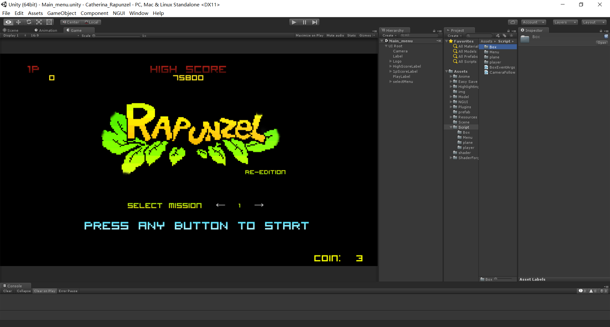
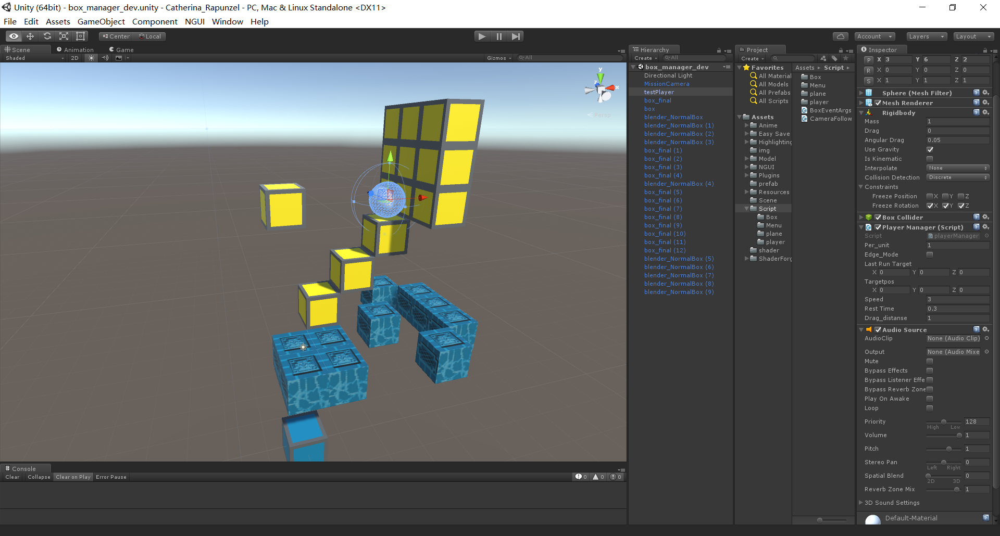

# Catherina_Rapunzel
Xbox/PS3上Catherina中内置的像素游戏Rapunzel，复刻版

playerManager.cs:
  player的控制操作脚本,可以完成爬上箱子，推箱子，悬挂在箱子边缘移动的操作。
  
BoxManager.cs:
  箱子对自身的检查，包括在什么情况下可以停靠，受重力下落的判定。(未完成)

MainMenu:借助NGUI插件实现

box_manager_dev Scene:

2016/11/22 Build.
